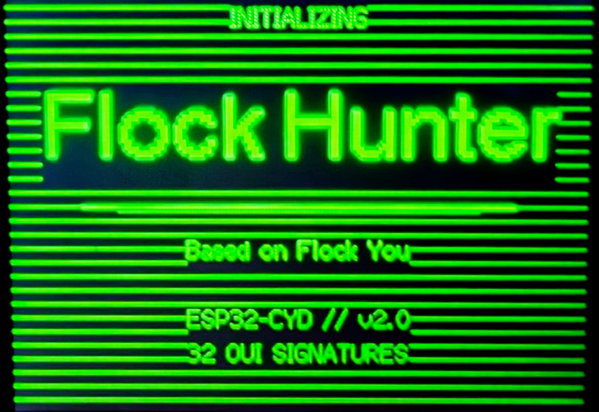

# Flock Hunter

A passive WiFi-based Flock Safety camera detector built for the **ESP32-2432S028R** (Cheap Yellow Display / CYD) board. Sniffs 2.4GHz management and data frames for known Flock Safety MAC OUI prefixes without transmitting — completely passive reconnaissance. Captures raw 802.11 packets to SD card in pcap format for Wireshark analysis. Optional GPS module logs detection coordinates to KML files for mapping in Google Earth.




## Credits

This project evolved from the original **[Flock You](https://github.com/colonelpanichacks/flock-you)** project by **[colonelpanichacks](https://github.com/colonelpanichacks)**. The OUI signature list, detection methodology, and core concept all originate from that project. Full credit to the original creator for the research identifying Flock Safety camera MAC prefixes and building the first detection firmware.

This firmware and documentation were built with **[Claude](https://claude.ai)** by Anthropic.

## How It Works

Flock Safety cameras periodically emit WiFi probe requests and other management frames as part of their normal operation. Each network device's MAC address begins with a 3-byte OUI (Organizationally Unique Identifier) assigned to the hardware manufacturer. Researchers identified 32 OUI prefixes consistently associated with Flock Safety camera deployments through field testing. This firmware puts the ESP32 into promiscuous mode and passively listens for WiFi packets whose source or destination MAC matches one of those 32 known OUI prefixes.

### Detection Methods

| Method | Description | Confidence |
|--------|-------------|------------|
| `WILD_PROBE` | Wildcard probe request from a Flock OUI — the camera is actively searching for networks | Highest |
| `OUI_TX` | Transmitter MAC (addr2) matches a Flock OUI | High |
| `OUI_RX` | Receiver MAC (addr1) matches a Flock OUI — unicast frame to a Flock device | Medium |

### Channel Hopping

The detector cycles through WiFi channels **1, 6, and 11** (the three non-overlapping 2.4GHz channels) with a 150ms dwell time per channel, ensuring comprehensive coverage of all standard WiFi traffic.

## Hardware

### ESP32-2432S028R (CYD) Board
- **MCU:** ESP32-D0WD-V3 (dual-core 240MHz)
- **Display:** 2.8" ILI9488 TFT, 320x480 pixels
- **SD Card:** Built-in micro SD slot
- **RGB LED:** Built-in (active low)
- **USB:** USB-C (CH340 serial + power) + Micro USB (power only)

### Wiring

The CYD board has a **CN1 expansion header** with 4 pins. The GPS module connects here. The buzzer connects directly to GPIO 26 (JST connector or solder).

| Component | Pin | CYD Connection |
|-----------|-----|----------------|
| **GPS TX** | GPIO 22 | CN1 pin 2 |
| **GPS RX** | GPIO 27 | CN1 pin 3 |
| **GPS VCC** | 3V3 | CN1 pin 4 |
| **GPS GND** | GND | CN1 pin 1 |
| **Buzzer (+)** | GPIO 26 | JST speaker connector or solder |
| **Buzzer (-)** | GND | Any GND point |

> **GPS and buzzer are optional.** The detector works without them — GPS adds location mapping and the buzzer adds audio alerts.

> **SD card** uses the built-in slot on the back of the CYD — no wiring needed, just insert a FAT32-formatted card.

## SD Card + PCAP + GPS Logging

Insert a **FAT32-formatted micro SD card** (any size, 4-8GB recommended) and the detector automatically logs raw 802.11 packets and GPS-tagged detections.

### Folder Structure

Each boot creates a new session:
```
/flock/
  session_001/
    pcap/capture.pcap        <- raw 802.11 frames, open in Wireshark
    csv/detections.csv       <- detection log with GPS coordinates
    csv/detections.kml       <- open directly in Google Earth/Maps
  session_002/
    ...
```

### Using with Wireshark

1. Drive around with the detector running and SD card inserted
2. Pull the SD card and plug it into your computer
3. Open the `.pcap` file in [Wireshark](https://www.wireshark.org/)
4. You'll see full 802.11 management and data frames — frame types, MAC addresses, probe request SSIDs, data rates, and more

### GPS Mapping with Google Earth

1. Drive around with the GPS module connected and SD card inserted
2. Pull the SD card and open `detections.kml` in [Google Earth](https://earth.google.com/)
3. Each detected camera appears as a red pin with MAC address, signal strength, channel, and detection method

The CSV file contains the same data in spreadsheet format for custom analysis.

The scan screen shows **SD: OK  PCAP: REC** when the card is working, or **SD: NONE** if no card is detected.

## UI Screens

### Boot Screen
Displays "Flock Hunter" title, "Based on Flock You" credit line, version info, and OUI signature count.

### Scanning Screen
- Green header bar with "FLOCK HUNTER" title
- Animated "SCANNING..." text with cycling dots
- Three channel indicator boxes (CH 1, CH 6, CH 11) highlighting the active channel
- Live packet counter and camera counter
- Live "in range" counter showing how many cameras are currently active
- Live GPS satellite count
- SD card and PCAP recording status
- Uptime display

### Alert Screen
Triggered on new camera detection:
- Red flashing for 1 second, then solid display for 4 seconds
- "FLOCK CAMERA DETECTED" banner
- Full details: MAC address, signal strength (dBm + CLOSE/NEAR/FAR), channel, frequency, detection method, OUI prefix, GPS coordinates, satellite count
- RGB LED turns red
- Audio alert tone (800-1900Hz sweep) if optional speaker is connected

### Camera List Screen
- Shows the 4 most recent detected cameras with MAC address, RSSI, range (CLOSE/NEAR/FAR), channel, and detection method
- Green/red status dots for active/stale cameras
- Displays for 5 seconds before returning to scan mode

## LED Indicators

| State | LED Color | Behavior |
|-------|-----------|----------|
| Boot | Blue | Solid |
| Scanning | Green | Pulsing (sine wave breathing) |
| Detection | Red | Solid during alert |

## 32 Flock Safety OUI Prefixes

```
70:C9:4E  3C:91:80  D8:F3:BC  80:30:49  B8:35:32
14:5A:FC  74:4C:A1  08:3A:88  9C:2F:9D  C0:35:32
94:08:53  E4:AA:EA  F4:6A:DD  F8:A2:D6  24:B2:B9
00:F4:8D  D0:39:57  E8:D0:FC  E0:4F:43  B8:1E:A4
70:08:94  58:8E:81  EC:1B:BD  3C:71:BF  58:00:E3
90:35:EA  5C:93:A2  64:6E:69  48:27:EA  A4:CF:12
82:6B:F2  B4:1E:52
```

## Building & Flashing

### What You Need
- **ESP32-2432S028R** board (2.8" CYD with ILI9488 display, USB-C variant) — ~$10-15 on AliExpress/Amazon
- **Micro SD card** (FAT32 formatted, any size) — for PCAP capture and GPS logging
- **ATGM336H GPS module + antenna** (optional) — ~$3-5, for location mapping
- **Passive piezo buzzer** (optional) — ~$0.50, for audio alerts on GPIO 26
- **USB-C cable** (data cable, not charge-only)
- A computer (Windows, macOS, or Linux)

### Step 1: Install PlatformIO

**Option A — VS Code (recommended for beginners):**
1. Install [VS Code](https://code.visualstudio.com/)
2. Open VS Code, go to Extensions (Ctrl+Shift+X / Cmd+Shift+X)
3. Search for "PlatformIO IDE" and install it
4. Restart VS Code when prompted

**Option B — CLI only:**
```bash
pip install platformio
```

### Step 2: Download This Project
```bash
git clone https://github.com/LuxStatera/flock-hunter-cyd-wifi.git
cd flock-hunter-cyd-wifi
```
Or download the ZIP from GitHub and extract it.

### Step 3: Find Your Serial Port

Plug in the CYD via USB-C. Then find your port:

- **macOS:** `ls /dev/cu.usb*` (usually `/dev/cu.usbserial-XXXX`)
- **Windows:** Open Device Manager > Ports (COM & LPT) — look for CH340 (e.g. `COM3`)
- **Linux:** `ls /dev/ttyUSB*` (usually `/dev/ttyUSB0`)

> **Note:** If nothing shows up, you may need to install the [CH340 driver](https://sparks.gogo.co.nz/ch340.html) for your OS.

### Step 4: Update the Port in Config

Open `platformio.ini` and change the `upload_port` and `monitor_port` to match your port:
```ini
upload_port = /dev/cu.usbserial-110    ; <-- change this
monitor_port = /dev/cu.usbserial-110   ; <-- change this
```
On Windows it would look like:
```ini
upload_port = COM3
monitor_port = COM3
```

### Step 5: Flash the Firmware

**VS Code:** Open the project folder in VS Code, then click the arrow (Upload) button in the PlatformIO toolbar at the bottom.

**CLI:**
```bash
pio run -t upload
```

The first build takes a few minutes to download dependencies. Subsequent builds are faster. Once flashing completes, the device will reboot and start scanning automatically.

### Step 6: Monitor Serial Output (Optional)
```bash
pio device monitor -b 115200
```
This shows detection events and debug info in your terminal.

### Troubleshooting

| Problem | Solution |
|---------|----------|
| "Unable to verify flash chip connection" | Try a different USB cable (must be data, not charge-only). Reduce `upload_speed` to `115200` in platformio.ini |
| Port not found | Install the [CH340 driver](https://sparks.gogo.co.nz/ch340.html). Try a different USB port |
| Display is white/blank | The TFT_eSPI `User_Setup.h` in `.pio/libdeps/` must be blank — if it has pin definitions, clear the file and rebuild |
| Colors are inverted | The firmware already handles this with `tft.invertDisplay(true)`. If colors are wrong, your board may have a different panel variant |
| Display is rotated | Change `tft.setRotation(2)` in `src/main.cpp` — try values 0-3 to find the correct orientation for your board |
| SD card not detected | Make sure the card is FAT32 formatted (not exFAT). Cards 32GB and under are FAT32 by default |

### Configuration Notes
All display driver settings are defined in `platformio.ini` via build flags — the TFT_eSPI `User_Setup.h` is intentionally blank. If you need to change pins or display settings, edit the `build_flags` section in `platformio.ini`.

## Serial Output

The device logs detection events over serial at 115200 baud:
```
[FLOCK HUNTER] Booting...
[DISPLAY] w=320 h=480 (ILI9488)
[GPS] UART2 started on RX=22 TX=27
[SD] Card ready — 7627MB
[SD] Session: /flock/session_001
[FLOCK HUNTER] Scanning channels 1, 6, 11
[ALERT] 70:C9:4E:AB:CD:EF RSSI:-72 CH:6 OUI_TX
```

## Range Estimates

Range labels (CLOSE / NEAR / FAR) are rough estimates based on RSSI signal strength. Actual range varies with environment — walls, trees, antenna orientation, and transmit power all affect the signal. These labels are most useful while driving outdoors with line-of-sight to pole-mounted cameras.

## Flock Hunter Family

- **[Flock Hunter CYD WiFi](https://github.com/LuxStatera/flock-hunter-cyd-wifi)** — WiFi detector with 32 OUI prefixes + PCAP capture (this project)
- **[Flock Hunter CYD BLE](https://github.com/LuxStatera/flock-hunter-cyd-ble)** — Bluetooth detector scanning for manufacturer ID 0x09C8
- **[Flock Hunter D1 Mini WiFi](https://github.com/LuxStatera/flock-hunter-d1-mini-wifi)** — Compact WiFi detector with OLED display + piezo buzzer
- **[Flock Camera Emulator](https://github.com/LuxStatera/flock-camera-emulator)** — ESP32 test tool for validating detectors

## Legal Disclaimer

This device is a **passive receiver only**. It does not transmit, deauthenticate, jam, or interfere with any wireless communications. It operates the same way any WiFi-enabled device does when scanning for available networks. Monitoring publicly broadcast WiFi management frames is generally legal, but laws vary by jurisdiction. Check your local laws before use. This project is for educational and research purposes.
